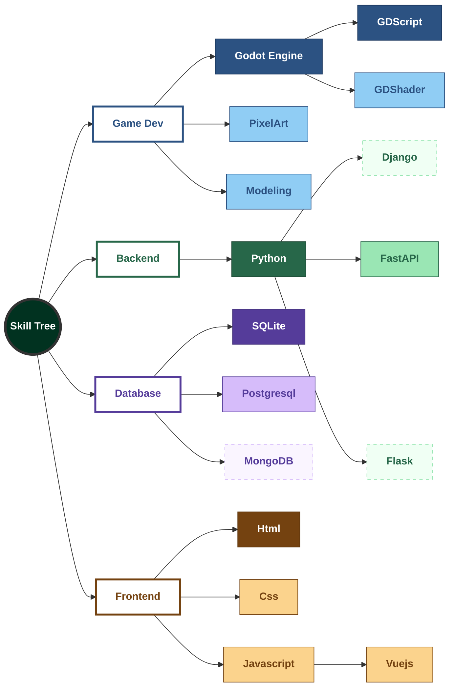

# HI, I'm tdbbb. Here's my github profile.

I am a indie game developer and backend engineer. Learning for interest.

## About me

- I am currently a senior student majoring in Information Management at National Kaohsiung University of Science and Technology(NKUST) in Taiwan.
  
- Specialize in game development and backend development.
  
- Specialize in both 2D and 3D game development.
  
- Keep exploring how to combine AI into gameplay.
  
- Like to explore new skills.

## Skill tree

## Skill stack

#### Game Development

#### Backend Development

#### Database

## Project showcase

## Contact me

- **Email:** tdbbb0427@gmail.com
- **Itch.io:** https://tdbbbfps.itch.io/
